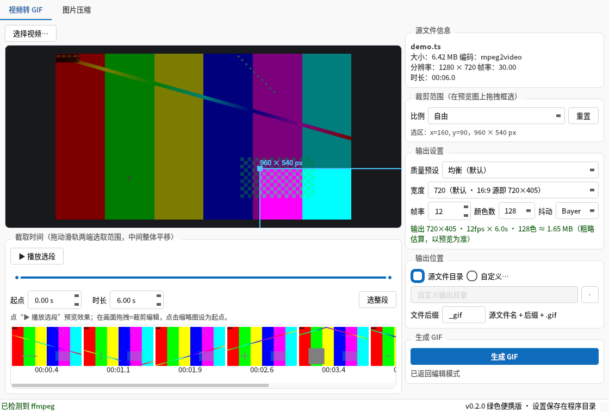
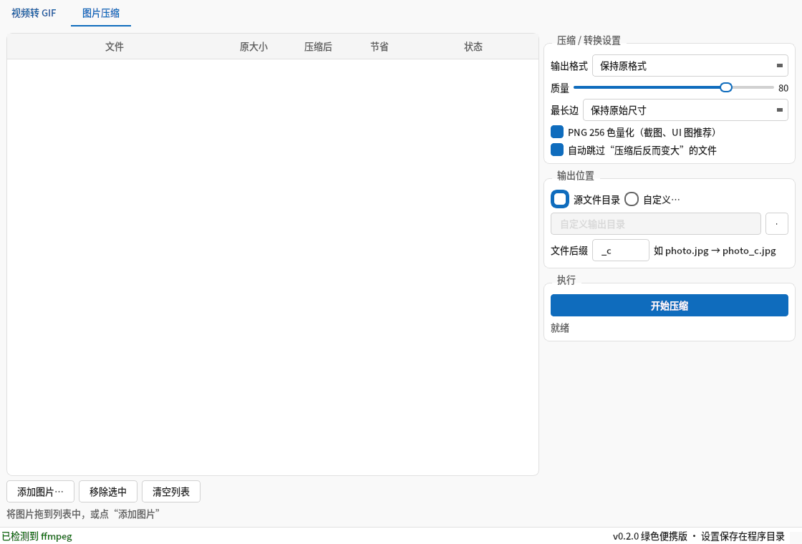

# GifKit — GIF 截取 & 图片压缩

Windows 绿色免安装小工具，做两件事：

1. **视频截取 GIF**：视频（TS / MP4 / MKV / AVI / MOV 等主流格式）直接拖进来，框选画面、选取时间段，**先完整生成、确认体积、再保存**。
2. **图片压缩 / 格式转换**：批量拖入图片，按质量/尺寸压缩或互转（JPG/PNG/WebP/BMP/TIFF），前后体积一目了然。



## ✨ 功能特性

### 🎬 视频转 GIF
- **拖入即用**：TS / M2TS / MTS / MP4 / MKV / AVI / MOV / FLV / WebM / WMV / MPG / 3GP 等；**动图 GIF 拖入即再压缩**（测试中 658KB → 187KB）
- **时间选取**：一条滑轨双滑块，可拖两端、可整体平移；缩略图条点击设为起点；时长未知（如部分 TS 流）时支持手动输入
- **播放选段**：手动触发的选段预览，改参数自动按新参数重播，点击画面返回编辑
- **画面裁剪**：预览帧上拖拽框选，四角手柄缩放、框内拖动；比例锁定（自由 / 16:9 / 1:1 / 9:16 / 4:3 / 16:10）
- **输出参数**：宽度（默认 720，16:9 源即 **720×405**）、帧率 3–30 自由输入、颜色数 32–256、抖动算法（Bayer / Floyd / 无），另有"高质量 / 均衡 / 高压缩"三档预设
- **两遍调色板法**（palettegen + paletteuse，stats_mode=diff），实时体积估算、进度条、**可取消**（取消即杀 ffmpeg 进程，零残留）
- **两段式输出**：先在临时目录完整生成并内嵌播放、显示真实体积，确认后再保存到输出目录

### 🖼 图片压缩



- 批量拖入 / 添加，**JPG / PNG / WebP / BMP / TIFF 互转**（保持原格式或指定目标格式）
- 质量滑杆、最长边限制、PNG 256 色量化（截图 / UI 图推荐）
- **自动跳过"压缩后反而变大"的文件**；自动纠正 EXIF 旋转；16-bit、浮点、CMYK 等罕见像素模式也能正常压缩
- 前后体积对比、总节省统计

## 📦 下载使用

从 [Releases](../../releases) 下载 `GifKit.exe`（单文件绿色版，内含 ffmpeg，约 112MB），拷到任意 **Windows 10/11 x64** 机器双击即用，无需安装。设置自动保存在 exe 同目录的 `config.json`。

## 🛠 从源码运行

依赖：Python 3.10+（3.12 实测）

```bat
git clone https://github.com/wsztdd-ui/gif-image-toolkit.git
cd gif-image-toolkit
python -m pip install -r requirements.txt
powershell -ExecutionPolicy Bypass -File tools\install_ffmpeg.ps1
run.bat
```

> `bin\` 下的 ffmpeg.exe / ffprobe.exe（各约 77MB）不入库，`tools\install_ffmpeg.ps1` 会从 npmmirror 镜像一键下载解压（国内速度快）；bin 为空时程序也会回退到系统 PATH 中的 ffmpeg。

## 🔧 打包绿色版

```bat
build\build.bat          rem → dist\GifKit.exe   单文件版
build\build.bat onedir   rem → dist\GifKit\     文件夹版（启动更快）
```

## ✅ 测试

| 命令 | 覆盖内容 |
|---|---|
| `python tests\test_pipeline.py` | 端到端：TS 截取 720×405、裁剪、动图再压缩、图片压缩/量化 |
| `python tests\test_modes.py` | I;16 / F / CMYK / PA / La 等罕见像素模式 × JPEG/WebP/PNG |
| `python tests\test_cancel.py` | 取消生成后 ffmpeg 子进程零残留 |
| `python tests\test_movie_release.py` | 预览动画播放中保存，文件句柄正确释放 |
| `python tests\render_ui.py` | 离屏渲染 UI 冒烟（载入 → 播放 → 裁剪 → 图片页） |

## 📁 目录结构

```
src\
  main.py             入口 + Fluent 2 浅色主题（品牌蓝 #0F6CBD，思源黑体 Medium）
  core\               纯逻辑层（ffmpeg 封装 / 图片压缩 / 后台线程），不依赖 Qt 可独立测试
  ui\                 页面与控件（GIF 页 / 图片页 / 裁剪框选 / 双滑块时间条）
  utils\              便携配置、路径、格式化
tests\                离线测试脚本（见上表）
tools\                ffmpeg 一键下载脚本、Python 安装脚本
build\                PyInstaller spec 与打包脚本
fonts\                Source Han Sans CN Medium（随包内置）
docs\                 需求 / 设计 / 构建 / 使用文档
prototype\            可交互 HTML 原型
```

## 🧰 技术栈

[PySide6](https://doc.qt.io/qtforpython/)（Qt 6）· [Pillow](https://python-pillow.org/) · [FFmpeg](https://ffmpeg.org/) · [PyInstaller](https://pyinstaller.org/)

## 📄 协议

- 本项目代码以 [MIT](LICENSE) 协议开源。
- 内置字体 [Source Han Sans CN（思源黑体）](https://github.com/adobe-fonts/source-han-sans) 遵循 SIL Open Font License 1.1。
